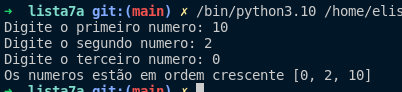

# Lista de Exercicios Python
**Curso**: Ciência da Computação

**Disciplina:** Fundamentos da Programação

**Universidade:** Instituto Federal de Educação, Ciência e TEcnologia do Ceará

## 1° Questão

--- 

**Problema:** Apresente um programa em python que leia do teclado um caractere c e dois inteiros n1 e n2.
Proceda da seguinte forma: 

* Se o caractere for '+', calcule e imprima a soma n1 + n2
* Se o caractere for '-', calcule e imprima a subtração n1 - n2
* Se o caractere for '/', calcule e imprima a divisão n1/ n2
* Se o caractere for '*', calcule e imprima a multiplicação n1 * n2
* Caso contrário, exiba "Operação Inválida"

**Resultado**

## 2° Questão
---
**Problema:** Faça uma função que recebe a média final de um aluno por parâmetro e retorna o seu conceito,
conforme a tabela abaixo:

Nota | Conceito
de 0.0 a 4.9 | D
de 5.0 a 6.9 | C
de 7.0 a 8.9 | B
de 9.0 a 10  | A

**Resultado:**

## 3° Questão
---
**Problema:** Crie uma função em python que receba 3 números e retorne em forma crescente.

**Resultado**

## 4° Questão
---
**Problema:** Ler um formato de número inteiro e verificar se o número corresponde a uma data válida no
calendário. Em seguida, escrever “Data Válida, 10 de julho de 2020, p.ex”; senão escrever uma
mensagem “Data Inválida”.

**Resposta**

## 5° Questão
---

**Problema:** Dado os índices de massa corporal e sua classificação, conforme tabela abaixo, crie uma função
em python para ler os valores (peso e altura) de uma pessoa e mostrar seu IMC,
CLASSIFICAÇÃO e OBESIDADE.

**Resposta**

